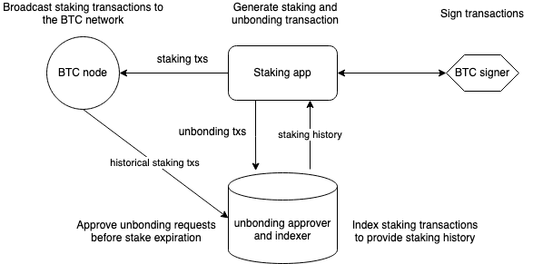

# Wallet Integration

The `bbn-test-4` testnet will focus on the security of the staked Bitcoins by
testing the user's interaction with the BTC signet network.
The testnet will be a lock-only network in which Bitcoin stake is going to be
created without a Babylon chain operating. Stakers can lock their funds for a
specific timelock and on-demand unbond if they want to unlock earlier than
that.

The testnet system is thus quite simple. It involves:
- A UI/UX that can generate Bitcoin Staking and Unbonding transactions
  and sign them through an interaction with a Bitcoin signer (e.g. a wallet).
- A Bitcoin node that propagates transactions to the Bitcoin network and
  is accessible by the UI/UX, either directly or through a wallet.
- A back-end system that indexes Bitcoin to collect information about the
  system and identify which stake is valid, as well as process unbonding
  requests.

The following figure shows a high-level overview of the testnet system:

In the following sections we explore the different ways a wallet can integrate
Bitcoin Staking and the materials required for each kind of integration.

## Ways to Integrate Bitcoin Staking

### 1. Extension Wallet

**Option-1**, be added to a third-party’s Bitcoin staking website.
This requires collaboration with the host of the website and
exposing compatible APIs.
To integrate with the Babylon hosted staking website, please check the
interface your wallet (or a wrapper of it) should adhere to
[here](https://github.com/babylonlabs-io/simple-staking/blob/main/docs/WalletIntegration.md).

**Option-2**, host your own Bitcoin staking website that
connects to your extension wallet that retrieves staking
information from a back-end you operate.
- To integrate with a staking website that uses the Babylon reference staking
  dApp [implementation](https://github.com/babylonlabs-io/simple-staking), please
  check the interface your wallet (or a wrapper of it) should adhere to 
  [here](https://github.com/babylonlabs-io/simple-staking/blob/main/docs/WalletIntegration.md).
- For information about developing your own Bitcoin staking website, please check
    - our [TypeScript](https://github.com/babylonlabs-io/btc-staking-ts)
      and [Golang](https://github.com/babylonlabs-io/babylon/tree/dev/btcstaking)
      Bitcoin Staking libraries.
    - our reference web application [implementation](https://github.com/babylonlabs-io/simple-staking).
- For information about operating your own back-end, please read this
  [document](./staking-backend.md)

**Option-3**, develop Bitcoin staking as a feature of your extension wallet,
which connects to either third party APIs
(such as the Babylon [API](https://staking-api.testnet.babylonchain.io/swagger/index.html)) or a back-end you operate.
- For information about developing your own Bitcoin staking as a feature, please check
    - our [TypeScript](https://github.com/babylonlabs-io/btc-staking-ts)
      and [Golang](https://github.com/babylonlabs-io/babylon/tree/dev/btcstaking)
      Bitcoin Staking libraries.
    - our reference web application [implementation](https://github.com/babylonlabs-io/simple-staking).
- For information about operating your own back-end, please read this
  [document](./staking-backend.md)

### 2. Mobile App Wallet

**Option-1**, embed a third-party Bitcoin staking website to your mobile app
wallet, which interacts with the BTC signer inside your wallet via
app window interface.
To embed on the Babylon hosted staking website, please check the
interface your mobile wallet (or a wrapper of it) should adhere to
[here](https://github.com/babylonlabs-io/simple-staking/blob/main/docs/WalletIntegration.md).

**Option-2**, host your own Bitcoin staking website that connects to your
extension wallet that retrieves staking information from a back-end you
operate. Then embed your own Bitcoin staking website to your mobile app wallet.
- To integrate with a staking website that uses the Babylon reference staking
  dApp [implementation](https://github.com/babylonlabs-io/simple-staking), please
  check the interface your mobile wallet (or a wrapper of it) should adhere to 
  [here](https://github.com/babylonlabs-io/simple-staking/blob/main/docs/WalletIntegration.md).
- For information about developing your own Bitcoin staking website, please check
    - our [TypeScript](https://github.com/babylonlabs-io/btc-staking-ts)
      and [Golang](https://github.com/babylonlabs-io/babylon/tree/dev/btcstaking)
      Bitcoin Staking libraries.
    - our reference web application [implementation](https://github.com/babylonlabs-io/simple-staking).
- For information about operating your own back-end, please read this
  [document](./staking-backend.md)

**Option-3**, develop Bitcoin staking as a feature of your extension wallet,
which connects to either third party APIs
(such as the Babylon [API](https://staking-api.testnet.babylonchain.io/swagger/index.html)) or a back-end you operate.
- For information about developing Bitcoin staking as a feature, please check
    - our [TypeScript](https://github.com/babylonlabs-io/btc-staking-ts)
      and [Golang](https://github.com/babylonlabs-io/babylon/tree/dev/btcstaking)
      Bitcoin Staking libraries.
    - our reference web application [implementation](https://github.com/babylonlabs-io/simple-staking).
- For information about operating your own back=end, please read this
  [document](./staking-backend.md)

### 3. Hardware Wallet

**Option-1**, develop Bitcoin staking as a feature of your extension wallet,
which connects to either third party APIs
(such as the Babylon [API](https://staking-api.testnet.babylonchain.io/swagger/index.html)) or a back-end you operate.
- For information about developing your own Bitcoin staking website, please check
    - our [TypeScript](https://github.com/babylonlabs-io/btc-staking-ts)
      and [Golang](https://github.com/babylonlabs-io/babylon/tree/dev/btcstaking)
      Bitcoin Staking libraries.
    - our reference web application [implementation](https://github.com/babylonlabs-io/simple-staking).
- For information about operating your own back-end, please read this
  [document](./staking-backend.md)

**Option-2**, integrate via a compatible software wallet (extension or mobile)
that is Bitcoin staking enabled.
To embed on the Babylon hosted staking website, please check the
interface your hardware wallet (or a wrapper of it) should adhere to
[here](https://github.com/babylonlabs-io/simple-staking/blob/main/docs/WalletIntegration.md).
